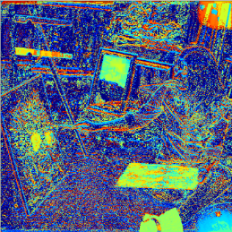
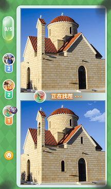
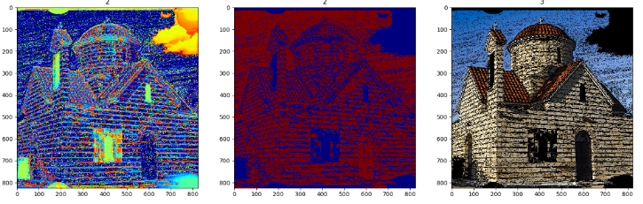

# wechat_zhaocha_game
python 微信小程序 《大家来找茬腾讯版》 辅助

找茬游戏分为两种模式：一种是闯关模式，一种是对战模式。通过辅助脚本可以清晰显示两幅图片的不同之处。

<center></center>

## 致敬wechat_jump_game
受到[wechat_jump_game](https://github.com/wangshub/wechat_jump_game)启发，简单制作了一个找茬辅助工具，在这里感谢此项目，部分代码来自该项目。

## 原理说明
1. 进入《大家来zhao》界面
2. 使用ADB工具获取当前手机截图，并用ADB将截图pull上来
```
adb shell screencap -p /sdcard/autojump.png
adb pull /sdcard/autojump.png .
```

3. 寻找两幅图片的差异
``` Python
im, region_1, region_2 = read_image()
output = region_1 - region_2
img2gray = cv2.cvtColor(output, cv2.COLOR_BGR2GRAY)
eq = cv2.equalizeHist(img2gray)  # 灰度图像直方图均衡化
im_color = cv2.applyColorMap(eq, cv2.COLORMAP_JET)
```
4. 用ADB工具点击屏幕，圈出差异位置
```
adb shell input swipe x y x y time(ms)
```

## 使用教程

1. 下载[ADB](http://adbshell.com/downloads)，要保证可以调用adb命令
2. 模式选择：如果是挑战模式，则设置`Challenge_Mode = False`；如果是闯关模式，则设置`Challenge_Mode = True`。
3. 运行ZhaoCha_v1.0.py
4. 注意：单击鼠标左键则选定标定位置，单击鼠标右键刷新图片
5. 程序运行会显示如下图像，然后左键单击颜色高亮的位置，即可完成标注。该图片完成之后，用单击鼠标右键刷新图像

<center></center>

## 其他示例：
输入图像：
<center></center>

输出图像：
第一幅为直方图均衡化之后的伪彩色图像，第二幅为二值分割后的结果，第三幅图为截取的原图。
<center></center>
